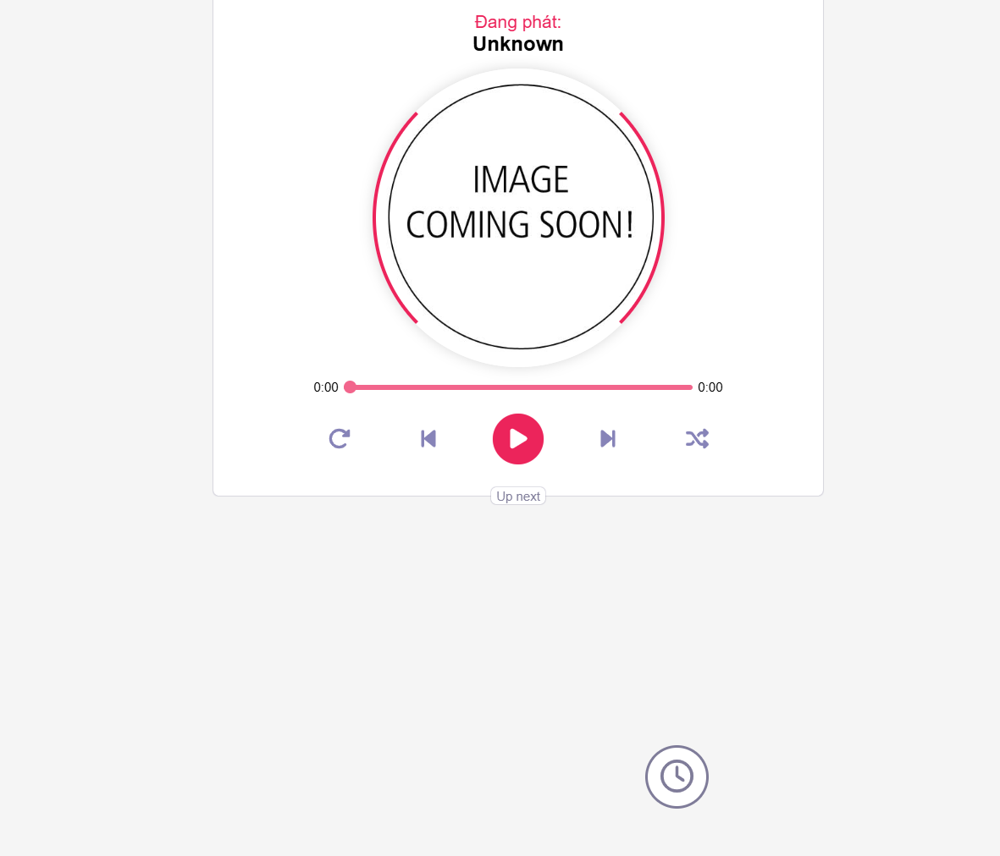

<h1> Web server cho Speaker </h1>
Đây là web app + server hỗ trợ cho [Speaker IoT] (https://github.com/baovkb/Speaker)
<h3> Cách cài đặt </h3>

- Tải php trên trang chính thức của php [php](https://www.php.net/downloads.php)

- Tải Composer trên trang chính thức [composer](https://getcomposer.org/download/)

- Tải Laragon (khuyến nghị) hoặc Xampp 

- Di chuyển vào project cài đặt các dependency bằng lệnh ```composer install```

- Tìm địa chỉ ip của server rồi vào [app/core/Helper.php](app/core/Helper.php), chỉnh sửa đường dẫn của server

- Tại project, gõ lệnh ```php init.php``` để mở điểm kết nối websocket

- Tiến hành khởi chạy Laragon (Xampp) rồi truy cập vào web kiểm tra

Nếu thành công sẽ có hình như thế này
